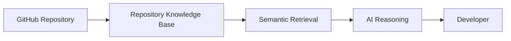
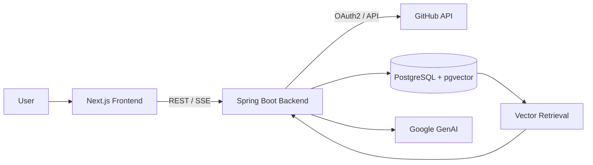
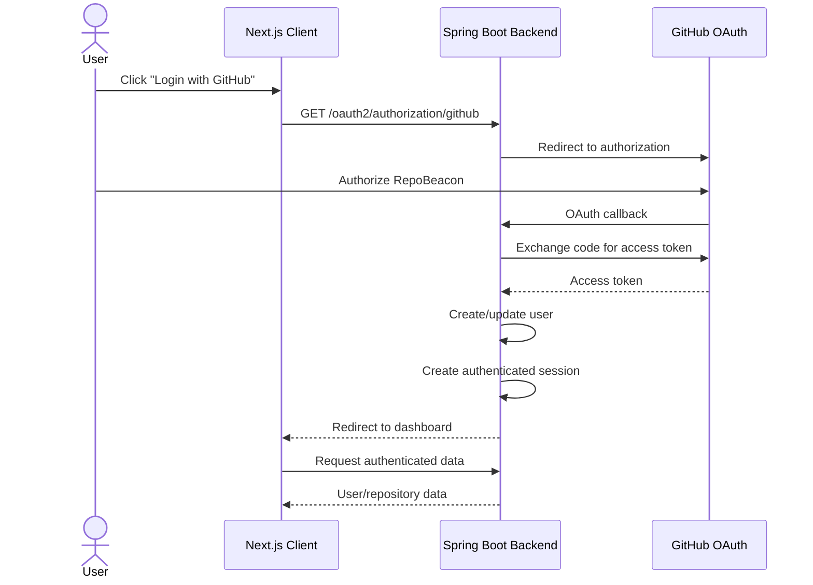
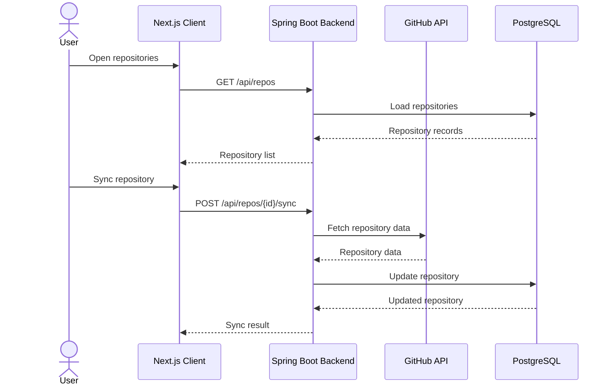
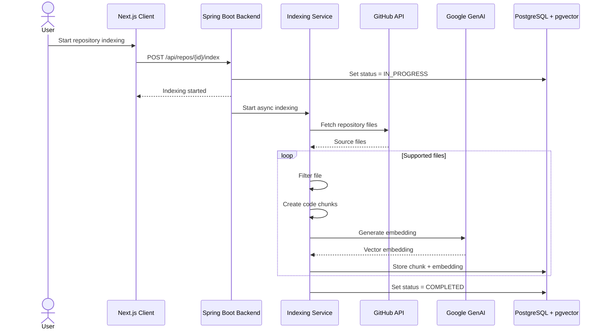

<div align="center">

# RepoBeacon

### AI-powered codebase assistant for understanding and interacting with GitHub repositories

<p>
  <strong>Full-stack • GitHub • Spring Boot • Next.js • RAG</strong>
</p>

<p>
  <a href="#current-status">Status</a>
  •
  <a href="#architecture">Architecture</a>
  •
  <a href="#tech-stack">Tech Stack</a>
  •
  <a href="#getting-started">Getting Started</a>
  •
  <a href="#roadmap">Roadmap</a>
</p>

</div>

---

RepoBeacon is a full-stack application designed to help developers understand their GitHub codebases through an AI-powered, context-aware interface.

The project connects GitHub repositories with a retrieval pipeline that indexes source code, stores vector representations in PostgreSQL + pgvector, and retrieves relevant code context for AI-powered conversations.

The project is currently under active development.

## Current Status

| Area                       | Status      |
| -------------------------- | ----------- |
| GitHub OAuth2              | Complete    |
| Landing Page               | Complete    |
| Dashboard Shell            | Complete    |
| Repository Management      | Complete    |
| Repository Synchronization | Complete    |
| Repository Indexing        | Complete    |
| Code Chunking              | Complete    |
| Vector Embeddings          | Complete    |
| PgVector Retrieval         | Complete    |
| Citation Mapping           | Complete    |
| Chat UI                    | In Progress |
| RAG / GenAI Responses      | In Progress |
| SSE Streaming              | Planned     |

### Completed

- GitHub OAuth2 authentication
- GitHub login flow
- User session handling
- Landing page
- Application dashboard shell
- Frontend UI foundation
- Backend authentication foundation
- PostgreSQL database integration
- Docker-based local PostgreSQL environment
- Repository management
- GitHub repository synchronization
- Repository indexing pipeline
- Source/config file filtering
- Ignored-directory filtering
- Token-based code chunking
- Google GenAI embeddings
- PostgreSQL + pgvector vector storage
- Repository-scoped vector similarity retrieval
- Citation mapping and JSON conversion
- Initial repository chat route
- Indexing progress, retry, and failure states

### In Progress

- End-to-end RAG pipeline
- Prompt and context construction
- Gemini-powered codebase chat
- Complete chat experience
- End-to-end source citations

### Planned

- Streaming AI responses using SSE
- AI-specific loading and error states
- Additional RAG improvements
- Production deployment and CI/CD

---

## Vision

RepoBeacon is designed to turn a GitHub repository into an interactive knowledge base.

The current RAG workflow is:



The goal is to allow developers to ask questions about their codebase and receive answers grounded in the actual repository contents.

---

## Architecture

The planned architecture consists of three primary components:



The AI/RAG components will be integrated into the backend as development progresses.

---

## Core Flows

### Authentication



### Repository Synchronization



### Repository Indexing



---

## Tech Stack

| Layer              | Technologies                                                        |
| ------------------ | ------------------------------------------------------------------- |
| **Frontend**       | Next.js, React, TypeScript, Tailwind CSS, shadcn/ui, TanStack Query |
| **Backend**        | Java, Spring Boot, Spring Security, Spring Data JPA, Spring AI      |
| **Database**       | PostgreSQL, pgvector, Flyway                                        |
| **AI**             | Google GenAI, Gemini, gemini-2.5-flash, gemini-embedding-001        |
| **Infrastructure** | Docker, Docker Compose                                              |
| **Integration**    | GitHub OAuth2, GitHub API                                           |

---

## Project Structure

```text
RepoBeacon/
│
├── backend/
│   ├── src/
│   │   ├── main/
│   │   │   ├── java/
│   │   │   └── resources/
│   │   └── test/
│   ├── pom.xml
│   └── mvnw
│
├── client/
│   ├── app/
│   ├── components/
│   ├── hooks/
│   ├── lib/
│   ├── providers/
│   └── package.json
│
├── docker/
│   └── postgres/
│
├── docker-compose.yml
└── README.md
```

---

## Getting Started

### Prerequisites

Make sure you have the following installed:

- Java
- Maven
- Node.js
- npm
- Docker
- Docker Compose
- PostgreSQL client (optional)

### 1. Clone the repository

```bash
git clone <repository-url>
cd RepoBeacon
```

### 2. Start PostgreSQL

```bash
docker compose up -d
```

Check the containers:

```bash
docker compose ps
```

### 3. Configure environment variables

Create the required environment variables for the backend and frontend.

The backen requires

- GitHub OAuth client ID
- GitHub OAuth client secret
- Google AI Studio API key
- Database configuration
- Token encryption configuration

> Do not commit secrets or credentials to the repository.

### 4. Start the backend

```bash
cd backend
./mvnw spring-boot:run
```

The backend runs on:

```bash
http://localhost:8080
```

### 5. Start the frontend

From the project root:

```bash
cd client
npm install
npm run dev
```

The frontend runs on:

```bash
http://localhost:3000
```

---

## Repository Indexing

RepoBeacon indexes repositories asynchronously before they can be queried through vector retrieval.

The indexing process:

1. Synchronizes repository contents from GitHub.
2. Filters supported source/configuration files.
3. Excludes configured ignored directories.
4. Splits source files into token-based chunks.
5. Generates vector embeddings using Google GenAI.
6. Stores embeddings and metadata in PostgreSQL + pgvector.
7. Tracks indexing progress and failure states.

Indexing can be triggered through:

```bash
POST /api/repos/{id}/index
```

---

## Vector Retrieval

The retrieval layer performs vector similarity search against indexed repository content.
Retrieved chunks are filtered by repository ID to ensure that code context comes from the selected repository.
The retrieval results are converted into context objects that can later be supplied to the AI generation pipeline.
Citation metadata is preserved so responses can reference the relevant source files.

---

## Development Roadmap

### v1.0.0 — App Shell

The first major milestone focuses on establishing the complete application foundation.

#### Authentication

- [x] GitHub OAuth login
- [x] User/session handling
- [x] Authentication API

#### Application

- [x] Landing page
- [x] Dashboard shell
- [x] Repository management
- [x] Repository synchronization
- [x] Settings
- [x] Complete application states

#### Infrastructure

- [x] Spring Boot backend
- [x] Next.js frontend
- [x] PostgreSQL
- [x] Docker development environment
- [ ] Flyway migrations
- [ ] CI

### v2.0.0 — RAG / GenAI

The second major milestone will introduce the AI codebase assistant.

#### Indexing

- [x] Repository indexing
- [x] Source-code fetching
- [x] Source/config file filtering
- [x] Ignored-directory filtering
- [x] Code chunking
- [x] Google GenAI embeddings
- [x] pgvector storage

#### Retrieval

- [x] Semantic retrieval
- [x] Repository-scoped vector search
- [x] Retrieved context mapping
- [x] Citation mapping

#### AI

- [ ] RAG pipeline
- [ ] Prompt/context construction
- [ ] Gemini-powered codebase chat
- [ ] SSE streaming
- [ ] End-to-end source-code citations
- [ ] AI-specific loading/error states

---

## Git Workflow

RepoBeacon follows a simple feature-based Git workflow.

- `main` — stable, release-ready branch
- `develop` — integration branch for completed features
- `feature/*` — individual feature development

### Workflow

1. Create a feature branch from `develop`.
2. Develop and commit changes on the feature branch.
3. Open a pull request from `feature/*` → `develop`.
4. Review and squash-merge the feature into `develop`.
5. When a release is ready, open a pull request from `develop` → `main`.
6. Squash-merge the release and create a version tag.

```text
feature/* → develop → main
              │
              └── release tag (e.g. v1.0.0)
```

---

<div align="center">

**RepoBeacon**

Built to make codebases easier to understand.

</div>
