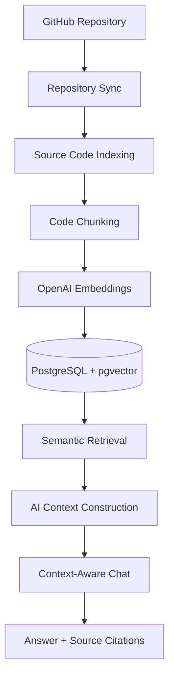
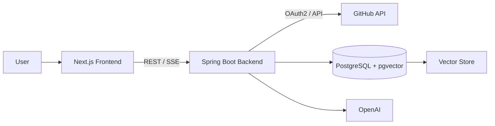
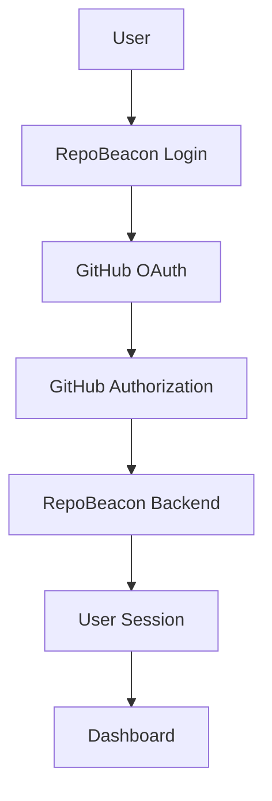
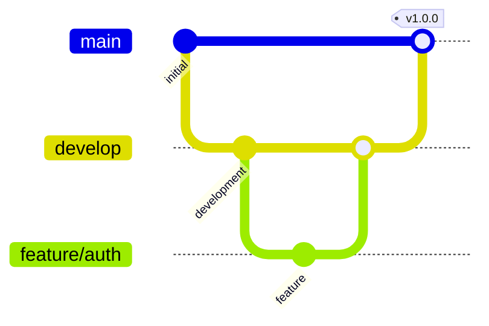

<div align="center">

# RepoBeacon

### AI-powered codebase assistant for understanding and interacting with GitHub repositories.

<p>
  <strong>Full-stack • GitHub • Spring Boot • Next.js • RAG</strong>
</p>

<p>
  <a href="#current-status">Status</a>
  •
  <a href="#architecture">Architecture</a>
  •
  <a href="#tech-stack">Tech Stack</a>
  •
  <a href="#getting-started">Getting Started</a>
  •
  <a href="#roadmap">Roadmap</a>
</p>

</div>

---

RepoBeacon is a full-stack application that aims to help developers understand their GitHub codebases through an AI-powered, context-aware interface.

The project is currently under active development.

## Current Status

| Area                       | Status      |
| -------------------------- | ----------- |
| GitHub OAuth2              | Complete    |
| Landing Page               | Complete    |
| Dashboard Shell            | Complete    |
| Repository Management      | In Progress |
| Repository Synchronization | In Progress |
| RAG / GenAI                | Planned     |

### Completed

- GitHub OAuth2 authentication
- GitHub login flow
- User session handling
- Landing page
- Application dashboard shell
- Initial frontend UI foundation
- Backend authentication foundation
- PostgreSQL database integration
- Docker-based local PostgreSQL environment

### In Progress

- Repository management
- GitHub repository synchronization
- Application settings
- Complete dashboard functionality
- Frontend/backend integration for repository features

### Planned

- Repository source-code indexing
- Code chunking
- OpenAI embeddings
- PostgreSQL + pgvector vector search
- Retrieval-Augmented Generation (RAG)
- Context-aware codebase chat
- Streaming AI responses using SSE
- Source-code citations

---

## Vision

RepoBeacon is designed to turn a GitHub repository into an interactive knowledge base.

The long-term workflow is:



The goal is to allow developers to ask questions about their codebase and receive answers grounded in the actual repository contents.

---

## Architecture

The planned architecture consists of three primary components:



The AI/RAG components will be integrated into the backend as development progresses.

---

## Tech Stack

| Layer              | Technologies                                                        |
| ------------------ | ------------------------------------------------------------------- |
| **Frontend**       | Next.js, React, TypeScript, Tailwind CSS, shadcn/ui, TanStack Query |
| **Backend**        | Java, Spring Boot, Spring Security, Spring Data JPA, Spring AI      |
| **Database**       | PostgreSQL, pgvector, Flyway                                        |
| **AI**             | OpenAI, `gpt-4o-mini`, `text-embedding-3-small`                     |
| **Infrastructure** | Docker, Docker Compose                                              |

---

## Project Structure

```text

RepoBeacon/
│
├── backend/
│   ├── src/
│   │   ├── main/
│   │   │   ├── java/
│   │   │   └── resources/
│   │   └── test/
│   ├── pom.xml
│   └── mvnw
│
├── client/
│   ├── app/
│   ├── components/
│   ├── hooks/
│   ├── lib/
│   ├── providers/
│   └── package.json
│
├── docker/
│   └── postgres/
│
├── docker-compose.yml
└── README.md

```

---

## Getting Started

### Prerequisites

Make sure you have the following installed:

- Java
- Maven
- Node.js
- npm
- Docker
- Docker Compose
- PostgreSQL client (optional)

### 1. Clone the repository

```bash
git clone <repository-url>
cd RepoBeacon
```

### 2. Start PostgreSQL

```bash
docker compose up -d
```

Check the containers:

```bash
docker compose ps
```

### 3. Configure environment variables

Create the required environment variables for the backend and frontend.

The application requires GitHub OAuth credentials for authentication.

> Do not commit secrets or credentials to the repository.

### 4. Start the backend

```bash
cd backend
./mvnw spring-boot:run
```

The backend runs on:

```bash
http://localhost:8080
```

### 5. Start the frontend

From the project root:

```bash
cd client
npm install
npm run dev
```

The frontend runs on:

```bash
http://localhost:3000
```

---

## Authentication

RepoBeacon currently uses GitHub OAuth2 for authentication.
The authentication flow is:



## GitHub access tokens are handled by the backend and are not intended to be exposed to the frontend.

## Development Roadmap

### v1.0.0 — App Shell

The first major milestone focuses on establishing the complete application foundation.

#### Authentication

- [x] GitHub OAuth login
- [x] User/session handling
- [x] Authentication API

#### Application

- [x] Landing page
- [x] Dashboard shell
- [ ] Repository management
- [ ] Repository synchronization
- [ ] Settings
- [ ] Complete application states

#### Infrastructure

- [x] Spring Boot backend
- [x] Next.js frontend
- [x] PostgreSQL
- [x] Docker development environment
- [ ] Flyway migrations
- [ ] CI

### v2.0.0 — RAG / GenAI

The second major milestone will introduce the AI codebase assistant.

- [ ] Repository indexing
- [ ] Source-code fetching
- [ ] Code chunking
- [ ] OpenAI embeddings
- [ ] pgvector storage
- [ ] Semantic retrieval
- [ ] RAG pipeline
- [ ] Prompt/context construction
- [ ] AI codebase chat
- [ ] SSE streaming
- [ ] Source-code citations
- [ ] AI-specific loading/error states

---

## Git Workflow

RepoBeacon follows a simple feature-based workflow:



Branches

| Branch      | Purpose               |
| ----------- | --------------------- |
| `main`      | stable release branch |
| `develop`   | integration branch    |
| `feature/*` | individual features   |

Feature branches should be created from develop and merged back through pull requests.

---

<div align="center">

**RepoBeacon**

Built to make codebases easier to understand.

</div>
