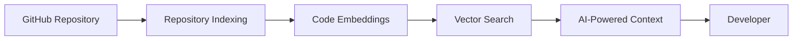
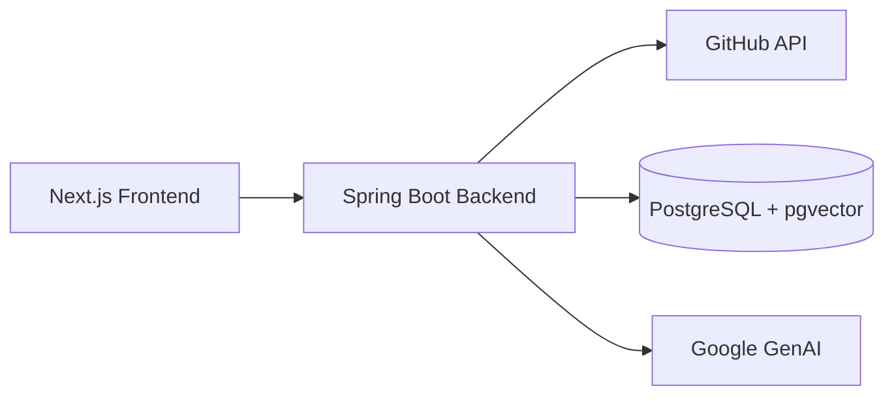

<div align="center">

# RepoBeacon

### AI-powered codebase assistant for understanding and interacting with GitHub repositories

<p>
  
  
  
  
  
  
</p>

<p>
  <strong>Full-stack RAG • GitHub Integration • Streaming AI Chat</strong>
</p>

<p>
  <a href="#current-status">Status</a>
  •
  <a href="#architecture">Architecture</a>
  •
  <a href="#core-flows">Core Flows</a>
  •
  <a href="#tech-stack">Tech Stack</a>
  •
  <a href="#getting-started">Getting Started</a>
  •
  <a href="#documentation">Documentation</a>
  •
  <a href="#roadmap">Roadmap</a>
</p>

</div>

---

## Current Status

### v2.0.0 — RAG & GenAI

RepoBeacon now supports end-to-end AI-powered codebase understanding. Repositories can be indexed into vector embeddings, relevant code can be retrieved through repository-scoped semantic search, and Gemini can use that context to generate grounded responses. The release also includes persistent chat sessions, streaming responses through SSE, and source citations for retrieved code.

### Next

- Production deployment
- CI/CD
- Further RAG and retrieval improvements

---

## Vision

RepoBeacon is designed to make large GitHub repositories easier to understand and interact with through AI.



The goal is to provide developers with a context-aware assistant that can understand their codebase, retrieve relevant source code, and answer questions based on the actual repository rather than generic assumptions.

---

## Architecture

RepoBeacon follows a layered architecture where the Next.js frontend communicates with a Spring Boot backend, which orchestrates GitHub integration, repository indexing, vector retrieval, and AI-powered responses.



The backend acts as the central orchestration layer, handling authentication, repository synchronization, indexing, retrieval, and chat while the frontend provides the developer-facing interface.
For a detailed overview of the system architecture and component responsibilities, see [`docs/architecture.md`](docs/architecture.md).

---

## Core Flows

### Authentication

GitHub OAuth2 is used to authenticate users and establish secure application sessions.

→ [Detailed authentication flow](docs/authentication.md)

### Repository Sync

Users can connect and synchronize their GitHub repositories with RepoBeacon for indexing and AI-powered code understanding.

→ [Detailed repository synchronization flow](docs/repository-sync.md)

### Repository Indexing

Repositories are processed asynchronously, filtered, chunked, embedded, and stored in PostgreSQL with pgvector for semantic retrieval.

→ [Detailed repository indexing flow](docs/repository-indexing.md)

### RAG Chat

User questions are matched against repository context, passed to Gemini for grounded response generation, and streamed back through SSE with source citations.

→ [Detailed RAG chat flow](docs/rag-chat.md)

---

## Tech Stack

<div align="center">
<table >
<tr>
<td width="50%">

### 🖥️ Frontend


</td>
<td width="50%">

### ⚙️ Backend


</td>
</tr>

<tr>
<td>

### 🤖 AI & RAG


</td>
<td>

### 🗄️ Data & Persistence


</td>
</tr>

<tr>
<td>

### 🔗 Integration


</td>
<td>

### 🛠️ Development


</td>
</tr>
</table>
</div>

---

## Related Topics

`AI` · `RAG` · `Codebase Assistant` · `GitHub` · `Developer Tools` · `Semantic Search` · `Code Intelligence`

---

## Project Structure

```text
RepoBeacon/
├── backend/
│   └── src/main/java/com/repobeacon/backend/
│       ├── config/
│       ├── controllers/
│       ├── dto/
│       ├── entity/
│       ├── repository/
│       ├── security/
│       └── services/
├── client/
│   ├── app/
│   ├── components/
│   ├── hooks/
│   ├── lib/
│   └── providers/
├── docs/
├── docker/
└── docker-compose.yml
```

---

## Getting Started

### Prerequisites

- Java 17+
- Node.js 20+
- Maven
- Docker and Docker Compose
- PostgreSQL with pgvector
- GitHub OAuth App credentials
- Google AI Studio API key

### 1. Clone the Repository

```bash
git clone https://github.com/MishraRoushankumar/RepoBeacon.git
cd RepoBeacon
```

### 2. Start PostgreSQL

```bash
   docker compose up -d
```

This starts the PostgreSQL service configured for RepoBeacon, including the required pgvector extension.

### 3. Configure the Backend

Create the required environment variables for GitHub OAuth and Google GenAI:

```text
GOOGLE_GENAI_API_KEY=your_google_genai_api_key
GOOGLE_GENAI_CHAT_MODEL=gemini-3.6-flash
GOOGLE_GENAI_EMBEDDING_TEXT_MODEL=gemini-embedding-001

GITHUB_CLIENT_ID=your_github_client_id
GITHUB_CLIENT_SECRET=your_github_client_secret

TOKEN_ENCRYPTOR_PASSWORD=your_encryption_password
TOKEN_ENCRYPTOR_SALT=your_encryption_salt
```

The default database configuration connects to:

```text
PostgreSQL
Host: localhost
Port: 5442
Database: repobeacon
Username: postgres
Password: postgres
```

### 4.Start the backend:

```bash
cd backend
./mvnw spring-boot:run
```

> The Spring Boot backend runs on port `8080`.

### 4. Start the Frontend

In a separate terminal:

```bash
cd client
npm install
npm run dev
```

> The Next.js development server runs on port `3000`.

---

## Documentation

Detailed architecture and implementation guides are available in the [`docs/`](docs/) directory.

| Document                                           | Description                                                     |
| -------------------------------------------------- | --------------------------------------------------------------- |
| [Architecture](docs/architecture.md)               | System architecture and component responsibilities              |
| [Authentication](docs/authentication.md)           | GitHub OAuth2 authentication flow                               |
| [Repository Sync](docs/repository-sync.md)         | GitHub repository synchronization flow                          |
| [Repository Indexing](docs/repository-indexing.md) | Code filtering, chunking, embeddings, and indexing              |
| [RAG Chat](docs/rag-chat.md)                       | Retrieval, prompt construction, Gemini streaming, and citations |
| [Data Model](docs/data-model.md)                   | Database entities and relationships                             |

---

## Roadmap

- [x] **v2.0.0 — RAG & GenAI**
  - Repository indexing and vector retrieval
  - Gemini-powered RAG chat
  - SSE streaming and persistent sessions
  - Source citations

### Next

- [ ] Production deployment
- [ ] CI/CD pipeline
- [ ] Further RAG and retrieval improvements

---

## Git Workflow

RepoBeacon follows a feature-branch workflow:

```text
feature/* → develop → main
```

- `feature/*` — Individual features and changes
- `develop` — Integration branch for completed features
- `main` — Stable, release-ready code

Feature branches are merged into `develop` through pull requests. Releases are promoted from `develop` to `main`.

---

---

<div align="center">

**RepoBeacon**

AI-powered codebase understanding for GitHub repositories

Built with ❤️ using Next.js · Spring Boot · PostgreSQL · pgvector · Gemini

</div>
