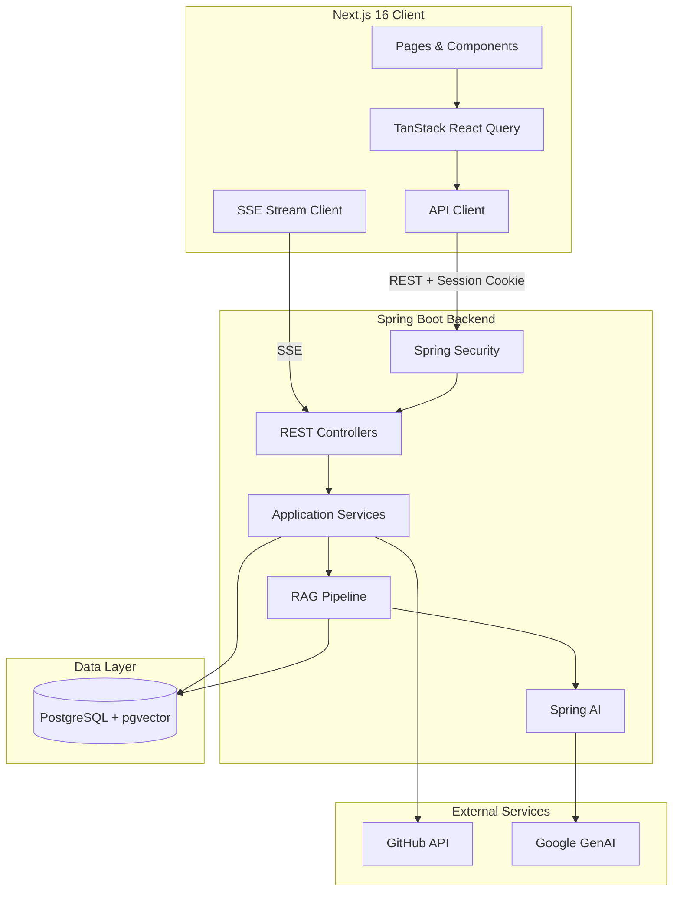

# RepoBeacon Architecture

RepoBeacon is a full-stack codebase assistant built around a Next.js client, Spring Boot backend, PostgreSQL + pgvector, GitHub integration, and Google GenAI.

## System Architecture

## Related Documentation

- [Authentication](authentication.md)
- [Repository Synchronization](repository-sync.md)
- [Repository Indexing](repository-indexing.md)
- [RAG Chat](rag-chat.md)
- [Data Model](data-model.md)
