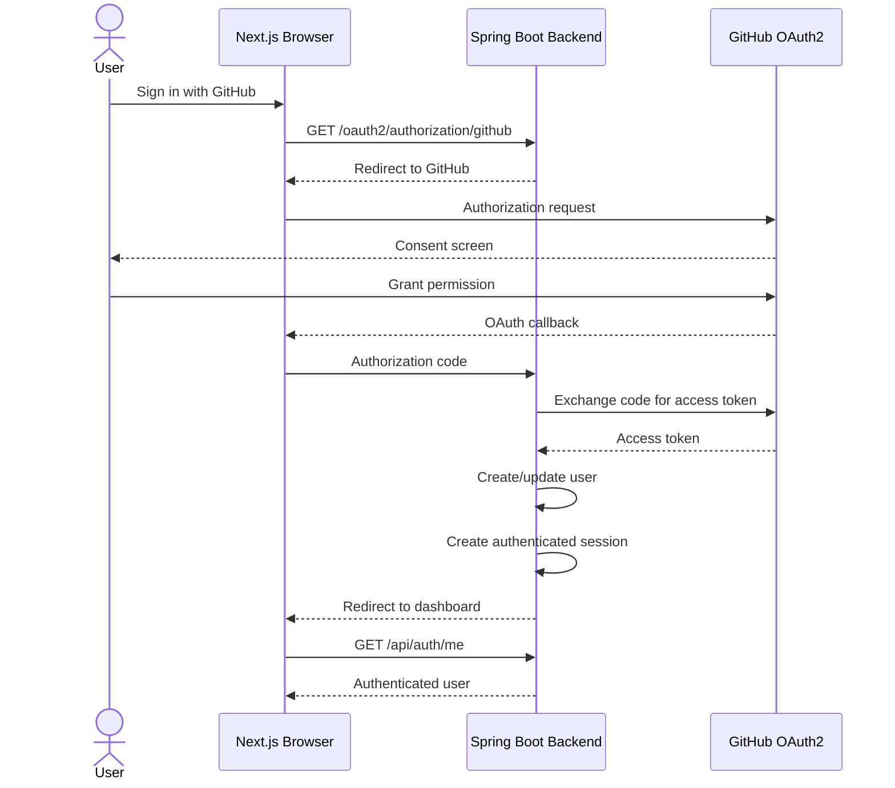

# GitHub OAuth2 Authentication

RepoBeacon uses GitHub OAuth2 for authentication. The backend owns the OAuth flow, user persistence, access-token handling, and authenticated session.

## Authentication Flow

GitHub access tokens are handled by the backend and are not intended to be exposed to the frontend.

## Related Documentation

- [Architecture](architecture.md)
- [Repository Synchronization](repository-sync.md)
