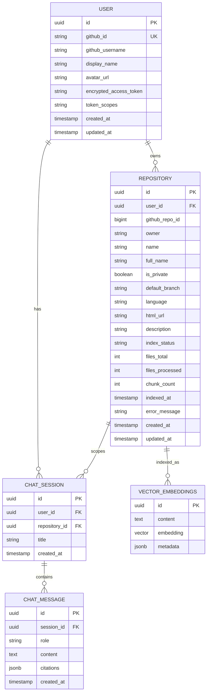

# Data Model

RepoBeacon uses PostgreSQL for application persistence and pgvector for repository vector data.

## Entity Relationships

## Main Relationships

- A `User` owns repositories and chat sessions.
- A `Repository` belongs to a user and scopes chat sessions.
- A `ChatSession` contains ordered `ChatMessage` records.
- Assistant messages can contain citation metadata.
- Repository source chunks are represented as vector embeddings for similarity retrieval.

## Related Documentation

- [Architecture](architecture.md)
- [Repository Indexing](repository-indexing.md)
- [RAG Chat](rag-chat.md)
