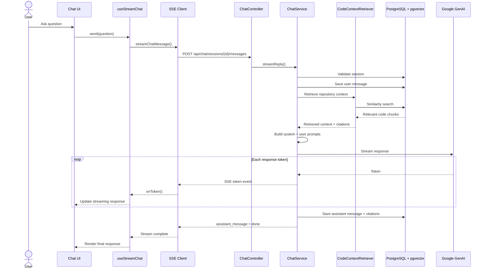

# RAG Chat

RepoBeacon combines repository-scoped vector retrieval with Google GenAI to answer questions using relevant code context.

## Streaming RAG Flow

## Chat Sessions

A chat session belongs to a user and repository. Messages are persisted as user or assistant messages so conversation history can be retrieved when a session is reopened.

## Retrieval

`CodeContextRetriever` performs vector similarity search against indexed repository content. Retrieval is scoped to the selected repository and currently uses a top-K value of 8 chunks.

## Prompt Construction

`ChatPromptBuilder` constructs system and user prompts. The system instructions establish RepoBeacon's behavior, while the user prompt contains retrieved repository context and the question.

## Citations

Retrieved chunks retain source metadata such as file path and line range. Citation metadata is mapped into `CitationDto` objects and persisted with assistant messages.

## SSE Events

The streaming flow communicates events including:

- `user_message`
- `token`
- `assistant_message`
- `done`
- `error`

The client can cancel an active stream using an abort controller.

## Related Documentation

- [Architecture](architecture.md)
- [Repository Indexing](repository-indexing.md)
- [Data Model](data-model.md)
