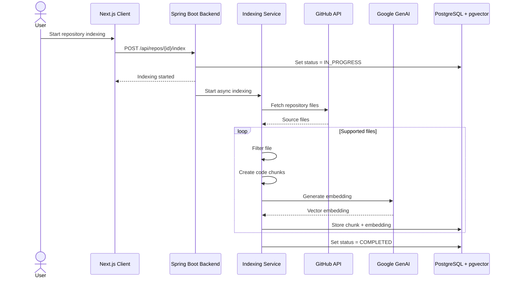
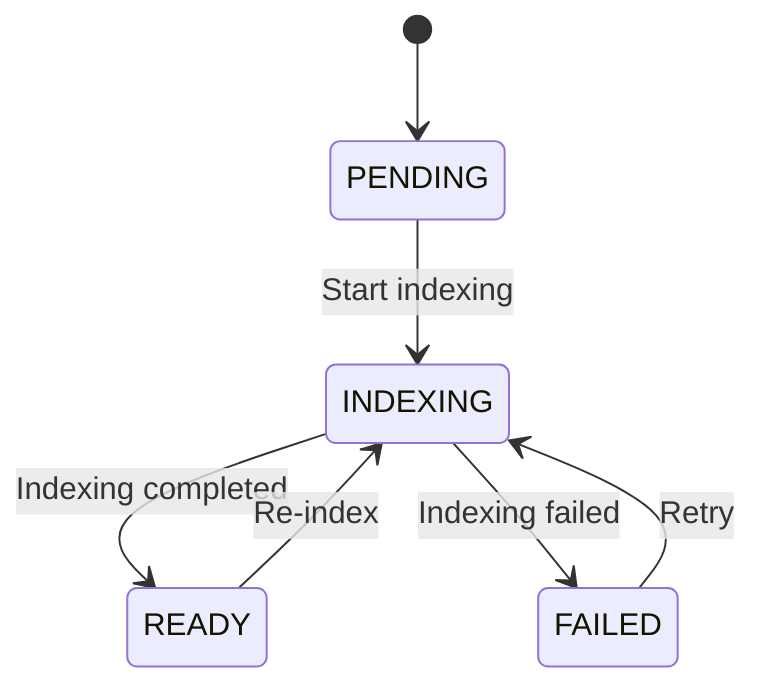

# Repository Indexing

RepoBeacon indexes repository source code asynchronously so that relevant code can later be retrieved through vector similarity search.

## Indexing Flow

## Pipeline

1. Fetch repository contents from GitHub.
2. Filter supported source/configuration files and ignored directories.
3. Split eligible files into token-based overlapping chunks.
4. Generate Google GenAI embeddings.
5. Store embeddings and metadata in PostgreSQL + pgvector.
6. Track indexing progress and failure state.
7. Mark successfully indexed repositories as ready for retrieval.

## Indexing Status

## Related Documentation

- [Architecture](architecture.md)
- [RAG Chat](rag-chat.md)
- [Data Model](data-model.md)
