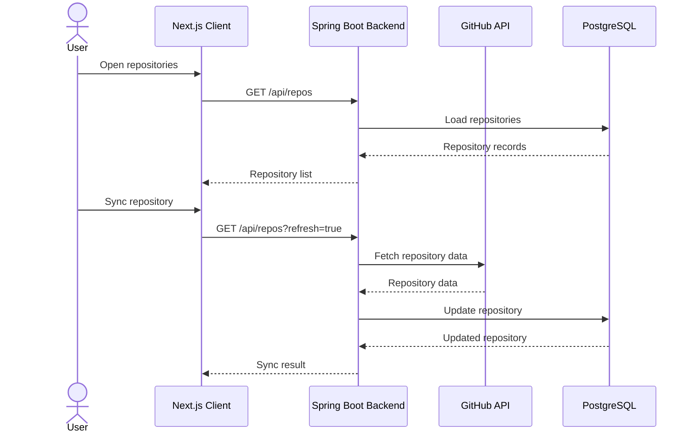

# Repository Synchronization

Repository synchronization connects RepoBeacon with GitHub and persists repository information used by the application and indexing pipeline.

## Synchronization Flow

## Role in the RAG Pipeline

Synchronization provides the repository metadata and GitHub access required by the indexing pipeline.

## Related Documentation

- [Architecture](architecture.md)
- [Repository Indexing](repository-indexing.md)
